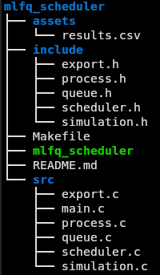

## MLFQ Scheduler Simulator 

Simulador de Multi-Level Feedback Queue (MLFQ) implementado en C. El programa modela un scheduler de CPU, simulando la ejecución de procesos en tiempo discreto y calculando métricas clásicas de planificación. 

El objetivo del proyecto es implementar un sistema organizado que permita analizar el comportamiento del algoritmo MLFQ y medir métricas como: 

- Response time 
- Turnaround time 
- Waiting time 

Los resultados se exportan automáticamente a un archivo CSV para su análisis posterior. 

### Descripción del algoritmo 

El Multi-Level Feedback Queue (MLFQ) es un algoritmo de scheduling que utiliza múltiples colas con diferentes prioridades y quantums de CPU.

Las características principales implementadas en este simulador son: 

- Prioridad entre colas: Siempre se ejecuta primero la cola de mayor prioridad que tenga procesos disponibles. 
- Round Robin dentro de cada cola
- Democión de procesos: Si un proceso consume completamente su quantum, baja a la siguiente cola. 
- No democión si termina antes del quantum
- Priority boost periódico: Cada cierto número de ciclos todos los procesos vuelven a la cola de mayor prioridad para evitar starvation. 
- Simulación por ciclos de reloj

### Configuración del scheduler 

El scheduler implementa tres niveles de prioridad. 

| Cola | Prioridad | Quantum  |
|------|-----------|----------|
| Q0   | Alta      | 2 ciclos |
| Q1   | Media     | 4 ciclos |
| Q2   | Baja      | 8 ciclos |

Reglas principales:  

1. Siempre se ejecuta la cola de mayor prioridad disponible.
2. Dentro de cada cola se usa Round Robin. 
3. Si un proceso usa todo su quantum, se demueve a la siguiente cola. 
4. Si un proceso termina antes del quantum, no cambia de cola. 
5. Cada 20 ciclos ocurre un Priority Boost. 

### Escenario de prueba 

El simulador utiliza el siguiente conjunto de procesos: 

| Proceso | Arrival Time | Burst time |
|---------|--------------|------------|
| P1      | 0            | 8          |
| P2      | 1            | 4          |
| P3      | 2            | 9          |
| P4      | 3            | 5          |

Esto significa: 

- arival_time: momento en que el proceso entra al sistema. 
- burst_time: tiempo total de CPU requerido. 

### Métricas calculadas 

Para cada proceso se calculan las siguientes métricas: 

- Response Time: Tiempo entre la llegada del proceso y su primera ejecución. `response_time = first_response_time − arrival_time` 
- Turnaround Time: Tiempo total que el proceso permanece en el sistema. `turnaround_time = finish_time − arrival_time` 
- Waiting Time: Tiempo total que el proceso estuvo esperando en las colas. `waiting_time = turnaround_time − burst_time` 

### Resultados de la  simulación

| PID | Arrival | Burst | Start | Finish | Response | Turnaround | Waiting |
|-----|---------|-------|-------|--------|----------|------------|---------|
| P1  | 0       | 8     | 0     | 23     | 0        | 23         | 15      |
| P2  | 1       | 4     | 2     | 14     | 1        | 13         | 9       |
| P3  | 2       | 9     | 4     | 26     | 2        | 24         | 15      |
| P4  | 3       | 5     | 6     | 21     | 3        | 18         | 13      |

Promedios: 

Response Time promedio: `(0 + 1 + 2 + 3) / 4 = 1.5`

Turnaround Time promedio: `(23 + 13 + 24 + 18) / 4 = 19.5` 

Waiting Time promedio: `(15 + 9 + 15 + 13) / 4 = 13` 

### Estructura del proyecto 

Descripción de modulos: 

- process: Maneja estructuras y métricas de procesos. 
- queue: Implementa la estructura de colas utilizada por el scheduler. 
- scheduler: Contiene la política MLFQ. 
- simulation: Ejecuta la simulación del scheduler ciclo por ciclo. 
- export: Exporta resultados a CSV. 

### Compilación 

Para compilar el proyecto: 

`make`

Esto general el ejecutable mlfq_scheduler 

### Ejecución

Ejecuta el simulador: 

`./mlfq_scheduler`

Salida esperada: 

P1 -> Response:0 Turnaround:23 Waiting:15 

P2 -> Response:1 Turnaround:13 Waiting:9 

P3 -> Response:2 Turnaround:24 Waiting:15 

P4 -> Response:3 Turnaround:18 Waiting:13

### Archivo de resultados

Los resultados se exportan automáticamente a: 

`assets/results.csv` 

Este archivo contiene todas las métricas de los procesos y puede abrirse en: 

- Excel 
- LibreOffice
- Python / Pandas
- R 

### Requisitos 

- GCC
- Make
- Sistema compatible con POSIX (Linux / macOS)

### Análisis del comportamiento del scheduler 

Esta sección analiza cómo distintos parámetros del algoritmo MLFQ afectan el comportamiento del sistema. 

**¿Qué ocurre si el boost es muy frecuente?** 

Si el priority boost ocurre con demasiada frecuencia, los procesos regresan constantemente a la cola de mayor prioridad (Q0). 

Esto tiene varios efectos: 

- Muchos procesos vuelven a competir en la cola de alta prioridad. 
- Los procesos largos que ya habían sido degradados vuelven a recibir prioridad alta. 
- El comportamiento del scheduler empieza a parecerse a Round Robin con quantum pequeño. 

Consecuencias: 

- Mejora el response time de algunos procesos. 
- Aumenta la cantidad de cambios de contexto. 
- Reduce la efectividad de la política de feedback del MLFQ. 

Podríamos decir que el sistema pierde parte de la ventaja de diferenciar procesos interactivos de procesos intensivos en CPU. 

**¿Qué ocurre si no existe boost?** 

Si no existe priority boost, los procesos que bajan a las colas de baja prioridad pueden quedarse allí por mucho tiempo. 

Esto puede provocar: 

- Procesos largos permanecen permanentemente en Q2. 
- Los procesos nuevos o interactivos continúan ejecutándose en colas superiores. 
- Algunos procesos pueden esperar durante largos periodos. 

Consecuencia principal: 

Puede aparecer starvation, donde procesos de baja prioridad casi nunca obtienen CPU. El priority boost se usa precisamente para evitar este problema. 

**¿Cómo afecta un quantum pequeño en la cola de mayor prioridad?** 

Un quantum pequeño en Q0 tiene efectos importantes en la política del scheduler. 

Ventajas: 

- Mejora el response time de procesos interactivos. 
- Permite reaccionar rápidamente a procesos nuevos. 
- Reduce el tiempo que un proceso puede monopolizar la CPU. 

Desventajas: 

- Aumenta el número de context switches. 
- Puede reducir la eficiencia del CPU si el overhead es alto. 

En el diseño típico de MLFQ, Q0 tiene el quantum más pequeño, lo que permite detectar rápidamente si un proceso necesita más CPU y degradarlo a colas inferiores. 

**¿Puede haber starvation?** 

Sí, puede haber starvation en el MLFQ si no se implementa un mecanismo para prevenirlo. 

Esto sucede cuando: 

- Siempre llegan procesos nuevos a colas de mayor prioridad. 
- Los procesos en colas bajas nunca vuelven a ejecutarse. 

En este simulador el problema se mitiga mediante el priority boost periódico, que: 

- mueve todos los procesos nuevamente a Q0 
- les da otra oportunidad de ejecutarse 

Gracias a este mecanismo, incluso los procesos de baja prioridad eventualmente obtienen CPU.