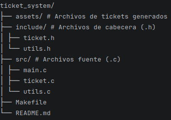

## Sistema de Gestión de Tickets en C

### Descripción

Este proyecto implementa un sistema básico de registro de tickets desarrolado en lenguaje C. 

El programa permite registrar una identificación, un correo electrónico y un tipo de reclamación, generando un archivo .txt por cada ticket creado. 

El sistema incluye validaciones de entrada, manejo dinámico de memoria y modularización del código fuente. 

### Estructura del Proyecto

### Compilar

Desde la raíz del proyecto ejecutar: 

`make`

Esto generará el ejecutable: 

`ticket_app`

### Ejecutar

`./ticket_app`

El programa solicitará: 

- Identificación (solo números)
- Correo electrónico (debe contener '@')
- Tipo de reclamación (no puede estar vacío)

En cualquier momento el usuario puede escribir:

`exit`

para finalizar el programa de forma segura. 

### Limpiar Archivos Generados

Para eliminar los archivos objeto y el ejecutable: 

`make clean`

Los archivo generados en la carpeta assets/ deben eliminarse manualmente si se desea limpiar completamente. 

### Uso de punteros 

El programa utiliza punteros para: 

- Reservar memoria dinámica para el struct Ticket.
- Almacenar dinámicamente cadenas (correo y tipo_reclamación).

Ejemplo: 

`Ticket *ticket = malloc(sizeof(Ticket));`

Los campos de tipo `char *` requieren memoria dinámica porque el tamaño de las cadenas no es fijo. 

### Manejo de Memoria 

Se utiliza `malloc()` para reservar memoria dinámica y `free()` para liberarla. Cada reserva de memoria es vaidada para evitar errores en tiempo de ejecución. 

La función `liberar_ticket()` centraliza la liberación de: 

- `ticket->correo`
- `ticket->tipo_reclamacion`
- `ticket`

Esto evita fugas de memoria. 

### Generación del Radicado

El número de radicado se genera utilizando: 

`time(NULL)`

Este valor representa el número de segundos desde el 1 de enero de 1970 (Epoch time). Se utiliza el identificador único del ticket y como parte del nombre del archivo generado. 

Ejemplo de archivo generado: 

`assets/ticket_1700000000.txt`

### Manejo de Errores

El sistema incluye validaciones para:

- Identificación vacía 
- Identificación no numérica 
- Correo vacío 
- Correo sin '@' 
- Tipo de reclamación vacío 
- Fallos en asignación de memoria 
- Fallos al crear el archivo

Además, el usuario puede salir del programa escribiendo `exit`

### Funcionamiento del Makefile

El Makefile automatiza el proceso de compilación. 

Variables principales: 

- `CC = gcc` 
- `CFLAGS = -Wall -Wextra -Iinclude` 
- `SRC = src/main.c src/ticket.c src/utils.c` 
- `TARGET = ticket_app` 

Reglas: 

- all: compila el programa
- clean: elimina archivos objeto y ejecutable

Se utiliza compilación separada para cada archivo fuente, permitiendo modularidad y compilación eficiente. 
